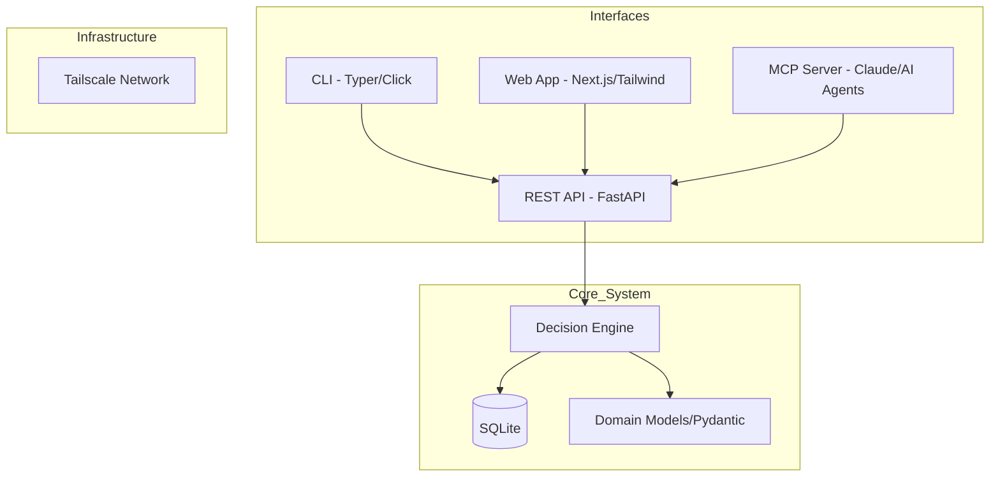

# CIBI (Can I Buy It?) - Project Specification & PRD

## 1. Vision & Core Philosophy
**CIBI**: Personal financial decision engine. Focuses on **future purchasing power** (not historical categorization).

**Equation**: `Purchasing Power = Balance - ∑(Recurring Obligations) - Safety Buffer`

Goal: Instant answer to *"If I buy this now, am I okay until next paycheck?"*

---

## 2. Domain Guidelines & Logic
All interfaces (CLI, Web, MCP) must adhere to these rules:

### 2.1 Reserved Funds Concept
- **Liquid**: Available now
- **Reserved**: Balance "spoken for" by upcoming obligations (rent, utilities, etc.)

### 2.2 Transaction Types
- **One-off**: Single impact
- **Recurring**: Frequency (daily/weekly/monthly) + next_occurrence
- **Forecasted**: Virtual txn predicting future balance

### 2.3 "Can I Buy It?" Decision Engine
1. Current balance
2. Project recurring txns from `now` to `next_payday`
3. Subtract sum from balance
4. Compare against item cost + Safety Buffer

---

## 3. System Architecture

CIBI follows a **Layered Hexagonal Architecture** to ensure the core logic is decoupled from the various interfaces (CLI, Web, MCP).

### 3.1 High-Level Diagram (Logical)

### 3.2 Tech Stack Recommendations
*   **Language:** Python 3.11+ (Best for MCP and logic complexity).
*   **API Framework:** FastAPI (Provides auto-generated OpenAPI docs for the Web/CLI).
*   **Database:** SQLite (Single file, perfect for local-first/Tailscale setups).
*   **CLI:** Typer (For a beautiful, type-safe command line).
*   **Web:** Next.js or a lightweight HTMX setup.
*   **AI Integration:** Model Context Protocol (MCP) to allow Claude to "read" your finances and act as a financial advisor.

---

## 4. Product Requirements Document (PRD)

### 4.1 Functional Requirements

#### FR1: Transaction Management
- CRUD for transactions
- Recurring logic: Weekly, Bi-weekly, Monthly, Yearly
- Manual balance adjustment

#### FR2: Decision Engine (CIBI Query)
- Input: `item_price`, `category` (optional)
- Output: `Boolean`, `Remaining_Buffer_Post_Purchase`, `Risk_Level`

#### FR3: Multi-Interface Access
- **CLI**: `cibi check 50.00 --category "Food"`
- **API**: Single source of truth for all modules
- **Web**: Dashboard (Reserved vs. Liquid)
- **MCP**: `get_financial_status()`, `check_purchase_feasibility(amount)`, `log_transaction(amount, description)`

### 4.2 Non-Functional Requirements
- **Privacy**: Zero cloud. Local data only.
- **Availability**: Accessible via Tailscale (mobile/laptop globally)
- **Latency**: <100ms calculation
- **Extensibility**: New interfaces (Telegram, etc.) plug into API without core logic changes

---

## 5. Data Schema (Core Entities)

### `Account`
* `id`: UUID
* `name`: String (e.g., "Chase Checking")
* `current_balance`: Decimal
* `currency`: String

### `Transaction`
* `id`: UUID
* `account_id`: ForeignKey
* `amount`: Decimal
* `description`: String
* `category`: String
* `timestamp`: DateTime
* `is_recurring`: Boolean
* `recurrence_rule`: String (RRULE format)
* `next_occurrence`: DateTime (null if one-off)

### `SafetyBuffer` (Global Config)
* `min_threshold`: Decimal (The amount that must always remain in the account).

---

## 6. Implementation Roadmap

### Phase 1: The Core (The "Engine")
*   Set up SQLite schema.
*   Implement FastAPI backend with Pydantic models.
*   Implement the `Decision Engine` logic.

### Phase 2: The Interfaces (The "Arms")
*   Build the CLI for rapid data entry.
*   Build the MCP server so Claude can interact with the API.
*   Build the Web Dashboard for visual overview.

### Phase 3: Connectivity (The "Nerves")
*   Configure Tailscale access.
*   Implement automated backups of the SQLite file.

***

### Instructions for Claude Code:
*   **Rule 1:** Always refer to `CIBI_SPEC.md` before implementing new features.
*   **Rule 2:** Do not bypass the API. All interfaces (CLI, Web, MCP) must communicate through the FastAPI layer to ensure the "Decision Engine" logic is centralized.
*   **Rule 3:** Prioritize the `Decision Engine` accuracy above all else. If a transaction is recurring, it MUST be accounted for in all "Can I Buy It?" calculations.